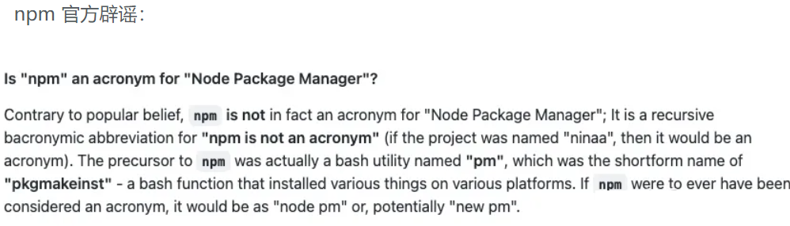
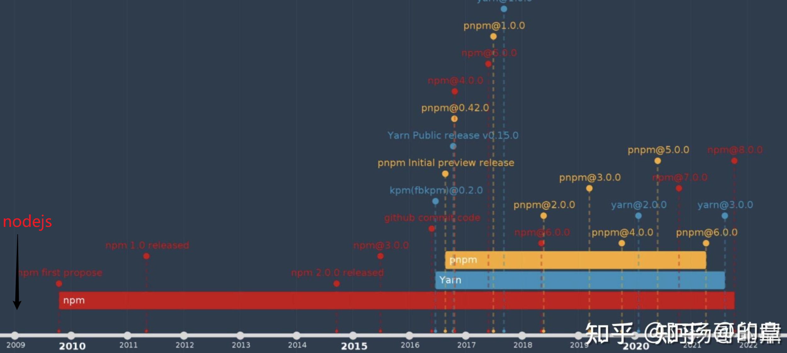
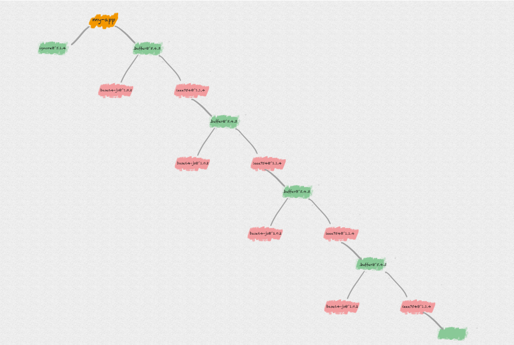
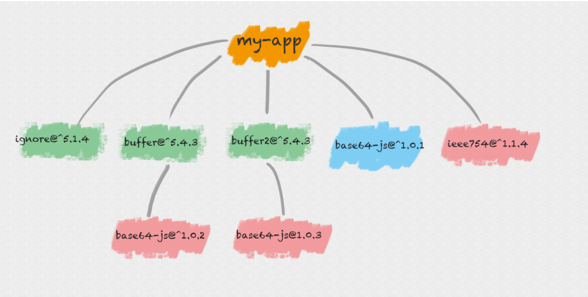
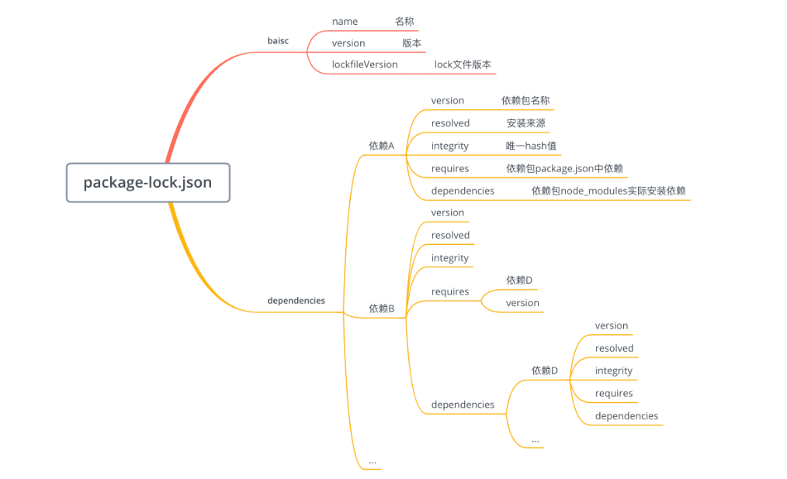
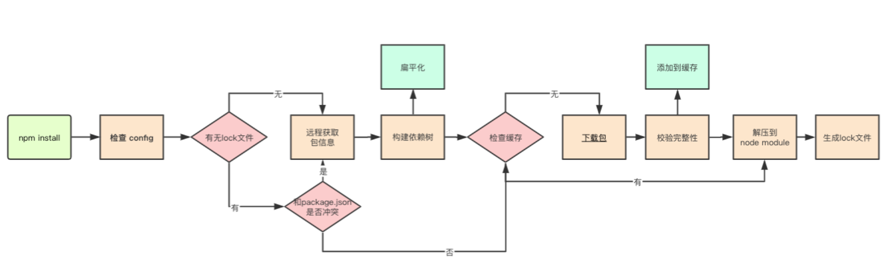
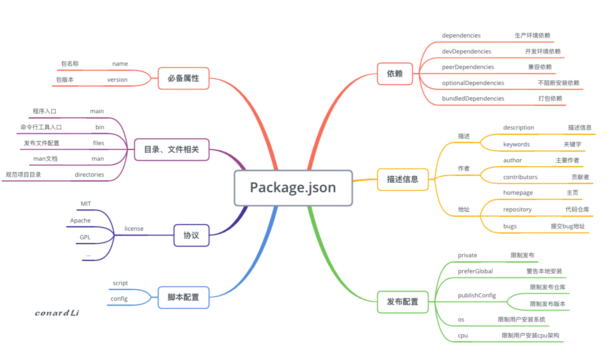

# npm常见面试问题
                                      常见问题有：
                                      1. npm run dev 原理
                                      2. npm install 原理
                                      3. npm publish 流程
                                      4. npm的package.json 原理
                                      5. npm的package.json 的常用字段
                                      6. npm的package.json中^,~着什么
                                      7. npm的package.json中依赖代表着什么（2022年底面试被问到）
                                      8. npm的package-lock.json是什么
                                      9. npm如何发包？ （2022年底面试被问到）
                                      10. npm面对依赖冲突如何解决？ 
                                      11. npm的幽灵依赖是什么？
                                      12. npm和pnpm优缺点是什么？ 
                                      13. 进阶-npm如何发布私有仓？
                                      14. 进阶-npm如何设置钩子？

                                      总结一下：npm在面试主要是3点。
                                      1. npm publish ，install，dev等命令原理
                                      2. npm的package.json文件配置。
                                      3. npm的优缺点和pnpm的优缺点。

                                      我们从这3点学习，不仅会面试的知识，更能提高工程化的效率。生成力大幅度提高了。

# 一、npm基本概念
## 1.npm是什么？

                                      NPM由三个不同的组成部分组成:
                                      1. 该网站
                                      2. CLI (Command Line Interface)
                                      3. 注册表
                                      4. npm 是node bash工具。

                                      1.使用该网站可以发现包、设置配置文件和管理npm体验的其他方面。例如，您可以设置组织来管理对公共或私有包的访问。
                                      2.CLI从终端运行，也是大多数开发人员与npm交互的方式。
                                      3.注册表是JavaScript软件及其周围元信息的大型公共数据库。世界上最大的软件注册表，来自各个大洲的开源开发人员使用npm来共享和借用包。
                                      4.npm并不是node package manager。它的前身其实是名为 pm（pkgmakeinst） 的 bash 工具，它可以在各种平台上安装各种东西。硬要说缩写的话，也应该是 node pm 或者 new pm。npm 之于 Node.js ，就像 pip 之于 Python， gem 之于 Ruby， pear 之于 PHP 。


## 2.为什么要有npm?
                                      原因：效率低下
                                      1. 想要下载第三方包，比如jq，BootStrap。，必须要去jq，BootStrap。官网下载后，然后导入本地，  --- 管理依赖问题
                                      2. 如果我自己像共享一个第三方包，自己需要搞一个网站发布。 --- 共享代码问题
                                      3. 多个第三方如果管理。--- 版本控制问题

                                      解决：一起管理
                                      Isaac Z. Schlueter （以下简称 Isaaz）给出一个解决方案：用一个工具把这些代码集中到一起来管理吧！
                                      具体步骤
                                      NPM 的思路大概是这样的：
                                      1. 买个服务器作为代码仓库（registry），在里面放所有需要被共享的代码
                                      2. 发邮件通知 jQuery、Bootstrap、Underscore 作者使用 npm publish 把代码提交到 registry 上，分别取名 jquery、bootstrap 和 underscore（注意大小写）
                                      3. 社区里的其他人如果想使用这些代码，就把 jquery、bootstrap 和 underscore 写到 package.json 里，然后运行 npm install ，npm 就会帮他们下载代码
                                      4. 下载完的代码出现在 node_modules 目录里，可以随意使用了。
                                      这些可以被使用的代码被叫做「包」（package），这就是 NPM 名字的由来：Node Package(包) Manager(管理器)。

                                      发展：天作之和
                                      Isaaz 通知 jQuery 作者 John Resig，他会答应吗？这事儿不一定啊，对不对。
                                      只有社区里的人都觉得 「npm 是个宝」的时候，John Resig 才会考虑使用 npm。
                                      那么 npm 是怎么火的呢？
                                      npm 的发展是跟 Node.js 的发展相辅相成的。
                                      Node.js 是由一个在德国工作的美国程序员 Ryan Dahl 写的。他写了 Node.js，但是 Node.js 缺少一个包管理器，于是他和 npm 的作者一拍即合、抱团取暖，最终 Node.js 内置了 npm。
                                      后来的事情大家都知道，Node.js 火了。
                                      随着 Node.js 的火爆，大家开始用 npm 来共享 JS 代码了，于是 jQuery 作者也将 jQuery 发布到 npm 了。
                                      所以现在，你可以使用 npm install jquery 来下载 jQuery 代码。
                                      现在用 npm 来分享代码已经成了前端的标配。
                                      4. npm 发展时间线：npm -version


## 3.安装npm
                                      1. 通过安装nodejs即可安装npm。
                                      npm -i npm@只当版本。

                                      2. 为什么nodejs和npm绑定。
                                      就是npm接nodejs之风。

                                      3.看一下nodejs之后安装的包
                                       node_cache目录通常用于存储Node.js的缓存文件，例如模块的缓存。 node_cache 存放的是 npm 下载时的缓存文件

                                       node_global目录通常用于存储全局安装的Node.js模块。node_global 存放的是 npm install -g 全局安装的指令模块 node_global 目录位置需要添加到环境变量 path 中，这样才能使用全局的 npm 命令

                                       node_modules目录是用于存储特定项目所需的Node.js模块的目录。

                                       npm是Node.js的包管理工具，用于安装、卸载和管理Node.js模块。

                                       npx是一个NPM包执行器，用于运行安装在node_modules中的特定包而无需全局安装。

                                      4. npm set 设置镜像源和环境变量。
                                      npm set registry https://registry.npm.taobao.org

                                      5. npm -v node下载后为什么输入npv -v可以展示出代码？
                                        cmd 输入字符串后处理逻辑
                                        1.判断是否是绝对路径，是的绝对路径找，没有找到抱错。
                                        2.不包括绝对路径，在cmd目录下寻找。
                                        3.系统的路径path默认文件下面找。system32文件里面。
                                      因为在环境变量和系统变量指定。
                                      不用在指定目录，可以在全局任何地方执行，执行的时候，在系统变量去依次执行。

## 4.npm查看常用命令
                                      npm info 包名：查看远程npm上指定包的所有版本信息
                                      npm search 包名：搜索是否包含报名关键字的所有信息。
                                      npm view 包名 version：查看某个 package 的最新版本。查看是否有。
                                      npm view 包名 versions：查看某个 package 在npm服务器上所有发布过的版本。
                                      npm list：查看当前目录下已安装的node包
                                      npm list -g：查看全局已经安装的node包
                                      npm ls:仓库依赖树上所有包的版本信息。
                                      npm config get cache:查看全局缓存
                                      在执行 npm install 或 npm update命令下载依赖后，除了将依赖包安装在node_modules 目录下外，还会在本地的缓存目录缓存一份。
                                      通过 npm config get cache 命令可以查询到：在 Linux 或 Mac 默认是用户主目录下的 .npm/_cacache 目录。
                                      在这个目录下又存在两个目录：content-v2、index-v5，content-v2 目录用于存储 tar包的缓存，而index-v5目录用于存储tar包的 hash。
                                      npm 在执行安装时，可以根据 package-lock.json 中存储的 integrity、version、name 生成一个唯一的 key 对应到 index-v5 目录下的缓存记录，从而找到 tar包的 hash，然后根据 hash 再去找缓存的 tar包直接使用。
                                      content-v2
                                      在_cacache目录下，有三个目录：
                                      content-v2
                                      index-v5
                                      tmp
                                      其中 content-v2 里面基本都是一些二进制文件。为了使这些二进制文件可读，我们把二进制文件的扩展名改为 .tgz，然后进行解压，得到的结果其实就是我们的 npm 包资源。
                                      而 index-v5 文件中，我们采用跟刚刚一样的操作就可以获得一些描述性的文件，事实上这些内容就是 content-v2 里文件的索引。

                                      那么这些缓存是如何生成的呢?
                                      当 npm install 执行时，通过pacote把相应的包解压在对应的 node_modules 下面。npm 在下载依赖时，先下载到缓存当中，再解压到项目 node_modules 下。pacote 依赖npm-registry-fetch来下载包，npm-registry-fetch 可以通过设置 cache 属性，在给定的路径下根据IETF RFC 7234生成缓存数据。
                                      然后在每次安装资源时，根据 package-lock.json 中存储的 integrity、version、name 信息生成一个唯一的 key，这个 key 能够对应到 index-v5 目录下的缓存记录。如果发现有缓存资源，就会找到 tar 包的 hash，根据 hash 再去找缓存的 tar 包，并再次通过pacote把对应的二进制文件解压到相应的项目 node_modules 下面，省去了网络下载资源的开销。
                                      
                                      注意
                                      这里提到的缓存策略是从 npm v5 版本开始的。在 npm v5 版本之前，每个缓存的模块在 ~/.npm 文件夹> > 中以模块名的形式直接存储，储存结构是：{cache}/{name}/{version}。
## 5.npm常用命令：npm install原理 重要！！！
                        npm常考面试就是3个：npm install 安装，npm run dev运行，npm publish发布。
                        了解一下基本知识：
                        1.全局安装和局部安装
                        npm i -g 是在全局，就是d盘下的。
                        但是很多人对全局安装有一些误会：

                        通常使用npm全局安装的包都是一些工具包：yarn、webpack等；全局安装只适用于工具模块，比如 eslint 和 gulp 。为了减少多重副本而使用全局模式，而是因为本地模式不会注册 PATH 环境变量。
                        并不是类似于 axios、express、koa等库文件；
                        所以全局安装了之后并不能让我们在所有的项目中使用 axios等库；

                        npm i 不加g，局部安装。

                        2. package.json中:开发依赖和生成依赖
                        dependencies:开发+生产：vue、vuex、vue-router、react、react-dom、axios。 npm i axios。默认是开发+生成。
                        devDependencies：生成环境不需要：比如webpack、babel等；npm i --save-dev; npm i -D;
                        peerDependencies：还有一种项目依赖关系是对等依赖，也就是你依赖的一个包，它必须是以另外一个宿主包为前提的；
                        比如element-plus是依赖于vue3的，ant design是依赖于react、react-dom；

                        3. package.json中:开发依赖和生成依赖后面的版本号

                        主版本号(major)：当你做了不兼容的API 修改
                        次版本号(minor)：当你做了向下兼容的功能性新增
                        修订号(patch)：当你做了向下兼容的问题修正。

                        "1.4.0": 固定版本号
                        "*": 任意版本（>=0.0.0）
                        "16.x": 匹配主要版本（>=16.0.0 <17.0.0）
                        "16.3.x": 匹配主要版本和次要版本（>=16.3.0 <16.4.0）
                        ~: 当安装依赖时，发现有新版本发布时候，接受该版本的主要版本号和次要版本号不变，但接受修订版本号的更新。~1.2.3 允许安装 1.2.3、1.2.4（会匹配所有的 1.2.X 版本），但不接受 1.3.0、2.0.0。
                        ^: 当安装依赖时，发现有新版本发布时候，安装到 x.y.z 中 y 和 z 都为最新版本。 即保持主版本号不变的情况下，保持次版本号、修订版本号为最新版本。（最多）

                        npm version patch v1.0.1
                        npm version minor v1.1
                        npm version major v2.

                        4. 剖析 npm install 原理
                        我们都知道，执行 npm install 后，依赖包被安装到了 node_modules ，下面我们来具体了解下，npm 将依赖包安装到 node_modules 的具体机制是什么。
                        4.1. 嵌套结构：
                        在不同层级的依赖中，可能引用了同一个模块，导致大量冗余。
                        在 Windows 系统中，文件路径最大长度为260个字符，嵌套层级过深可能导致不可预知的问题。


                        4.2.扁平结构：
                        安装模块时，不管其是直接依赖还是子依赖的依赖，优先将其安装在 node_modules 根目录。
                        所以 npm 3.x 版本并未完全解决老版本的模块冗余问题，甚至还会带来新的问题。npm install安装顺序的问题。
                        试想一下，你的APP假设没有依赖 base64-js@1.0.1 版本，而你同时依赖了依赖不同 base64-js 版本的 buffer 和 buffer2。由于在执行 npm install 的时候，按照 package.json 里依赖的顺序依次解析，则 buffer 和 buffer2 在  package.json 的放置顺序则决定了 node_modules 的依赖结构：
      

                        4.3. Lock文件
                        在 npm 5.x 版本新增了 package-lock.json 文件，而安装方式还沿用了 npm 3.x 的扁平化的方式。
                        package-lock.json 的作用是锁定依赖结构，即只要你目录下有 package-lock.json 文件，那么你每次执行 npm install 后生成的 node_modules 目录结构一定是完全相同的。
                        integrity：包 hash 值，基于 Subresource Integrity 来验证已安装的软件包是否被改动过、是否已失效


                        4.4.缓存
                        在执行 npm install 或 npm update命令下载依赖后，除了将依赖包安装在node_modules 目录下外，还会在本地的缓存目录缓存一份。

                        通过 npm config get cache 命令可以查询到：在 Linux 或 Mac 默认是用户主目录下的 .npm/_cacache 目录。

                        npm 在执行安装时，可以根据 package-lock.json 中存储的 
                        integrity、version、name 生成一个唯一的 key 
                        对应到 index-v5 目录下的缓存记录，
                        从而找到 tar包的 hash，然后根据 hash 再去找缓存的 tar包直接使用。

                        4.5.  文件完整性
                        在下载依赖包之前，我们一般就能拿到 npm 对该依赖包计算的 hash 值，例如我们执行 npm info 命令，紧跟 tarball(下载链接) 的就是 shasum(hash) ：
                        用户下载依赖包到本地后，需要确定在下载过程中没有出现错误，所以在下载完成之后需要在本地在计算一次文件的 hash 值，如果两个 hash 值是相同的，则确保下载的依赖是完整的，如果不同，则进行重新下载。

                        4.6.整体
                        好了，我们再来整体总结下上面的流程：

                        1.检查 .npmrc 文件：优先级为：项目级的 .npmrc 文件 > 用户级的 .npmrc 文件> 全局级的 .npmrc 文件 > npm 内置的 .npmrc 文件
                        2.检查项目中有无 lock 文件。
                        2.1 无 lock 文件：
                          2.1.1从 npm 远程仓库获取包信息
                          2.1.2根据 package.json 构建依赖树，构建过程：
                          构建依赖树时，不管其是直接依赖还是子依赖的依赖，优先将其放置在 node_modules 根目录。
                          当遇到相同模块时，判断已放置在依赖树的模块版本是否符合新模块的版本范围，如果符合则跳过，不符合则在当前模块的 node_modules 下放置该模块。
                          注意这一步只是确定逻辑上的依赖树，并非真正的安装，后面会根据这个依赖结构去下载或拿到缓存中的依赖包
                          2.1.3在缓存中依次查找依赖树中的每个包
                          2.1.3.1不存在缓存：
                            从 npm 远程仓库下载包
                            校验包的完整性
                            校验不通过：
                            重新下载
                            校验通过：
                            将下载的包复制到 npm 缓存目录
                            将下载的包按照依赖结构解压到 node_modules
                          2.1.3.2存在缓存：将缓存按照依赖结构解压到 node_modules
                            将包解压到 node_modules
                            生成 lock 文件
                        2.2有 lock 文件：
                        检查 package.json 中的依赖版本是否和 package-lock.json 中的依赖有冲突。
                        如果没有冲突，直接跳过获取包信息、构建依赖树过程，开始在缓存中查找包信息，后续过程相同


                        5.总结npm install的详细过程
                        1.检测依赖项：首先，npm会查看你的项目根目录下的package.json文件，该文件描述了项目所需的依赖项及其版本。npm会解析这个文件并找出所有的依赖项。
                        2.锁定依赖项：在解析完package.json后，npm会生成一个package-lock.json文件。这个文件记录了项目所有依赖项的确切版本，使得每次安装时都能确保相同的3.依赖项被安装，防止版本不一致的问题。
                        4.从npm仓库下载：然后，npm会查看你指定的每个依赖项的版本，并尝试从npm仓库（默认是npmjs.com）中下载。如果指定了npm镜像，那么将从镜像服务器下载压缩包。
                        5.缓存：从npm5开始，npm引入了缓存机制。下载的压缩包会被缓存，以便下次安装相同版本的依赖项时可以直接从缓存中获取，而无需重新下载。
                        6.解压和安装：下载的压缩包会被解压到项目的node_modules文件夹中。解压后，npm会通过执行每个包的preinstall脚本（如果有的话）进行任何预处理。如果没有preinstall脚本，或者preinstall脚本执行成功，那么npm会进入install阶段。install阶段会执行包的main脚本（如果有的话），这个脚本通常用于执行一些初始化代码，例如引入模块、输出日志等。
                        完成：最后，安装过程结束，安装的所有依赖项都在node_modules文件夹中，同时会在package-lock.json中记录下来。
                        
                        其中：获取模块的过程
                        获取模块是一个递归的过程，分为以下几步：
                        1.获取模块信息。在下载一个模块之前，首先要确定其版本，这是因为 package.json 中往往是 semantic version（semver，语义化版本）。此时如果版本描述文件（npm-shrinkwrap.json 或 package-lock.json）中有该模块信息直接拿即可，如果没有则从仓库获取。如 packaeg.json 中某个包的版本是 ^1.1.0，npm 就会去仓库中获取符合 1.x.x 形式的最新版本。
                        2.获取模块实体。上一步会获取到模块的压缩包地址（resolved 字段），npm 会用此地址检查本地缓存，缓存中有就直接拿，如果没有则从仓库下载。
                        3.查找该模块依赖，如果有依赖则回到第1步，如果没有则停止。
                        
                        其中：模块扁平化（dedupe）
                        获取到的是一棵完整的依赖树，其中可能包含大量重复模块。比如 A 模块依赖于 loadsh，B 模块同样依赖于 lodash。在 npm3 以前会严格按照依赖树的结构进行安装，因此会造成模块冗余。
                        从 npm3 开始默认加入了一个 dedupe 的过程。它会遍历所有节点，逐个将模块放在根节点下面，也就是 node-modules 的第一层。当发现有重复模块时，则将其丢弃。



## 6.npm常用命令：npm run dev原理
                              1.npm package.json的脚本
                              ```
                              scripts: {
                                dev:"vue-cli-service serve"
                                serve:"vue-cli-service serve"
                                start:"vue-cli-service start"
                                build:"vue-cli-service build"
                              }
                              ```

                              2. 不同于nodejs安装在系统环境。而是npm会把node_modules/.bin所有加入全局环境变量。

                              bin是软连接文件-> 然后找对应的js执行。
                              vue-cli-service 软连接脚本文件。
                              在vue-cli-service文件里面有个bash：@craco/craco/dist/bin/craco.js
                              在package-lock.json里面的bin会指向bin的vue-cli-service.js

                              直接用的话，不在全局会找不到。

                              3. 让webpack启动一个开发服务器
                              1.网页请求 开发服务器。
                              2. 开发服务器会从打包结果中取出内容。
                              3. 源码变化。打包内容变化，浏览器刷新，重新请求。

                              4. npm scripts 前后脚本
                              precompress:'echo 压缩前'
                              compress:'echo 压缩'
                              postcompress:'echo 压缩后'
                              node build/pass.js --name=$npm_config_name
                              新建pass.js文件脚本。

## 7.npm常用命令：npm publish发包流程（4步）
                            1. npm init -y ：初始化项目。
                            2. package.json：修改name和version。
                            3. npm login：输入账号和密码。
                            4. npm publish：发布。

## 8.npx
                            npx是npm v5.2.0引入的一条命令，它也是一个工具，但是不是包管理，而是包执行；npm 本身不能够执行任何包，对于本地项目的包，如果想要执行，则需要写入到 package.json 里面，然后通过 npm 来解析 package.json 文件，解析到包的 bin 文件路径，在 bash 中执行。我们要执行一个非本地的包，先要下载安装这个包到本地，执行上述步骤；但是有了npx之后，我们可以跳过npm install直接使用npx，主要特点是
                            1、临时安装可执行依赖包，不用全局安装，不用担心长期的污染。
                            2、可以执行依赖包中的命令，安装完成自动运行。
                            3、自动加载node_modules中依赖包，不用指定$PATH。
                            4、可以指定node版本、命令的版本，解决了不同项目使用不同版本的命令的问题。
                            比如npx create-react-app,执行这个命令的时候，npx将create-react-app下载到一临时目录，使用以后再删除。每次运行次命令，都会重新下载依赖包，运行后删除。原理是在运行它时，执行下列流程：

                            去node_modules/.bin路径检查npx后的命令是否存在，找到之后执行；
                            找不到，就去环境变量$PATH里面，检查npx后的命令是否存在，找到之后执行;
                            还是找不到，自动下载一个临时的依赖包最新版本在一个临时目录，然后再运行命令，运行完之后删除，不污染全局环境。
                            npx 由 npm v5.2 版本引入，解决了 npm 的一些使用快速开发、调试，以及项目内使用全局模块的痛点。

                            在传统 npm 模式下，如果我们需要使用代码检测工具 ESLint，就要先通过 npm install 安装

                            npm install eslint --save-dev
                            1
                            然后在项目根目录下执行：

                            ./node_modules/.bin/eslint --init
                            ./node_modules/.bin/eslint yourfile.js
                            1
                            而使用 npx 就简单多了，你只需要下面 2 个操作步骤：

                            npx eslint --init
                            npx eslint yourfile.js
                            1
                            2
                            这是因为它可以直接执行 node_modules/.bin 文件夹下的文件。在运行命令时，npx 可以自动去 node_modules/.bin 路径和环境变量 $PATH 里面检查命令是否存在，而不需要再在 package.json 中定义相关的 script。

                            npx 另一个更实用的好处是：npx 执行模块时会优先安装依赖，但是在安装执行后便删除此依赖，这就避免了全局安装模块带来的问题。
                            例如我们使用create-react-app创建工程。

                            npx create-react-app cra-project
                            1
                            npx 会将 create-react-app 下载到一个临时目录，使用以后再删除


# 二、npm package.json配置



## 依赖的区别？
                        dependencies:开发+生产：vue、vuex、vue-router、react、react-dom、axios。 npm i axios。默认是开发+生成。
                        devDependencies：生成环境不需要：比如webpack、babel等；npm i --save-dev; npm i -D;
                        peerDependencies：还有一种项目依赖关系是对等依赖，也就是你依赖的一个包，它必须是以另外一个宿主包为前提的；
                        比如element-plus是依赖于vue3的，ant design是依赖于react、react-dom；

## ^和~的区别？
                        ~: 当安装依赖时，发现有新版本发布时候，接受修订版本号的更新。~1.2.3 允许安装 1.2.3、1.2.4（会匹配所有的 1.2.X 版本），但不接受 1.3.0、2.0.0。
                        ^: 当安装依赖时，发现有新版本发布时候，接受修订版本号和次版本号的更新。发现有新版本发布时候，安装到 x.y.z 中 y 和 z 都为最新版本。 

## package-lock.json的原理
                        问题：主要是npm install，不同时间会有差异。两个人包不一样：主版本和次版本不匹配。

                        解决：如果写死一个依赖呢: 很多依赖控制不了的。
                        如果写死所有版本呢：整个依赖树版本的固定。package-lock.json.

                        用法：
                        升级依赖: 修改 package.json文件的依赖版本，执行 npm install
                        降级依赖: 直接执行 npm install package@version(改动package.json不会对依赖进行降级)
                        注意改动依赖后提交lock文件

# 三、npm和pnpm优缺点
## 1.npm缺点？幽灵依赖是什么？
## 2.pnpm优点和原理？
## 3.pnpm缺点？

                        1. npm2
                        在不同层级的依赖中，可能引用了同一个模块，导致大量冗余。
                        在 Windows 系统中，文件路径最大长度为260个字符，嵌套层级过深可能导致不可预知的问题。
                        1.npm3
                        npm lock.json
                        幽灵依赖：npm 可以访问它们没有在 'package.json' 中显示依赖的包。虽然package-lock.json有。但是import的时候，会有问题。
                        不确定性：同样的 package.json 文件，install 依赖后可能不会得到同样的 node_modules 目录结构。虽然package-lock.json有。
                        依赖分身：可以看到 B@2.0 会被安装两次，实际上无论提升 B@1.0 还是 B@2.0，都会存在重复版本的 B 被安装，这两个重复安装的 B 就叫 doppelgangers。

                        2. pnpm：
                        可以想象我们的全局存储相当于一个图书馆，里面的书就是一个个包。每本书都有唯一一个编号(包的版本)。现在有很多人(项目)想要借阅书来阅读。

                        符号链接就像是一个包含书籍位置信息的便签，它需要额外的存储空间来保存这些信息。如果你想要借书，图书馆就会给你一张便签，你通过这个便签去找书。图书馆如果更改了图书的位置，只要更新便签信息就可以了，不需要真正移动书，它允许项目以灵活的方式来访问依赖。

                        硬链接
                        .pnpm -> .pnpm.store
                        就像给借阅者提供一本书的复制品(想象它是一个引用)，复制品都指向同一本原书，图书馆也只要保留一本原书就可以，实际上占空间的也只有这一本书的大小，来一个人借阅，就给他一个复制品。

                        硬链接只能用于文件，不能用于目录。
                        软连接可以用于目录。
                        内容寻址存储 CAS
                        与依赖提升和扁平化的 node_modules 不同，pnpm 引入了另一套依赖管理策略：内容寻址存储。
                        该策略会将包安装在系统的全局 store 中，依赖的每个版本只会在系统中安装一次。
                        在引用项目 node_modules 的依赖时，会通过硬链接与符号链接在全局 store 中找到这个文件。为了实现此过程，node_modules 下会多出 .pnpm 目录，而且是非扁平化结构。

                        硬链接 Hard link：硬链接可以理解为源文件的副本，项目里安装的其实是副本，它使得用户可以通过路径引用查找到全局 store 中的源文件，而且这个副本根本不占任何空间。同时，pnpm 会在全局 store 里存储硬链接，不同的项目可以从全局 store 寻找到同一个依赖，大大地节省了磁盘空间。
                        符号链接 Symbolic link：也叫软连接，可以理解为快捷方式，pnpm 可以通过它找到对应磁盘目录下的依赖地址。
                        还是使用上面 A，B，C 模块的示例，使用 pnpm 安装依赖后 node_modules 结构如下：
                        <store>/xxx 开头的路径是硬链接，指向全局 store 中安装的依赖。

                        其余的是符号链接，指向依赖的快捷方式。

                        pnpm 官方图片也清晰地解释了这套机制：

                        这套全新的机制设计地十分巧妙，不仅兼容 node 的依赖解析，同时也解决了：

                        幽灵依赖问题：只有直接依赖会平铺在 node_modules 下，子依赖不会被提升，不会产生幽灵依赖。
                        依赖分身问题：相同的依赖只会在全局 store 中安装一次。项目中的都是源文件的副本，几乎不占用任何空间，没有了依赖分身。

                        3.pnpm缺点：

                        由于 pnpm 创建的 node_modules 依赖软链接，因此在不支持软链接的环境中，无法使用 pnpm，比如 Electron 应用。
                        因为依赖源文件是安装在 store 中，调试依赖或 patch-package 给依赖打补丁也不太方便，可能会影响其他项目。

                        4. yarn Plug’n’Play - 探索
                        静态映射表 pnp.cjs。

                        无论是 npm 还是 yarn，都具备缓存的功能，大多数情况下安装依赖时，其实是将缓存中的相关包复制到项目目录中 node_modules 里。

                        而 yarn PnP 则不会进行拷贝这一步，而是在项目里维护一张静态映射表 pnp.cjs。

                        pnp.cjs 会记录依赖在缓存中的具体位置，所有依赖都存在全局缓存中。同时自建了一个解析器，在依赖引用时，帮助 node 从全局缓存目录中发现依赖，而不是查找 node_modules。

                        这样就避免了大量的 I/O 操作同时项目目录也不会有 node_modules 目录生成，同版本的依赖在全局也只会有一份，依赖的安装速度和解析速度都有较大提升。

                        脱离 node 生态
                        pnp 比较明显的缺点是脱离了 node 生态。

                        因为使用 PnP 不会再有 node_modules 了，但是 Webpack，Babel 等各种前端工具都依赖 node_modules。虽然很多工具比如 pnp-webpack-plugin 已经在解决了，但难免会有兼容性风险。
                        PnP 自建了依赖解析器，所有的依赖引用都必须由解析器执行，因此只能通过 yarn 命令来执行 node 脚本。


